Hey there!
I attempt to learn SAP BW/4 in a day. As with any tool my preferred way of learning is hands-on. So I will set up a BW/4 and model some data objects. This is not necessarily meant as a tutorial to follow along. I will certainly make mistakes and meet some dead ends. Anyways I am sure it will be fun! So follow me along on my attempt to learn BW in a day.

## What is BW/4?

SAP BW/4HANA is often used as a corporate analytical Data Warehouse. The BW application has matured since 1998. It comes with its own vocabulary, learning ressources and legions of experts. 
BW/4 is SAP's packaged Business Warehouse application running on SAP's proprietary in-memory HANA database. HANA offers the option to store tables column- or row-wise. Column-wise is preferred for OLAP since it speeds up filtering and aggregations. BW is more than a database it is a whole Data Management solution. It is built on SAP's proprietary technology stack SAP Netweaver which in turn is built mainly on SAP's own programming language ABAP. Why would you opt for so much proprietary stuff? Apparently, every other setup makes retrieving data from SAP's ERP system really hard. And after all, this is where a large junk of the data that someone typically wants to analyze in a BW comes from.

In the non-SAP world you could probably use Python and a scheduler like Airflow + any RDBMS. If you are fancy you can add a graphical monitoring tool such as grafana in conjunction with prometheus. Or you use fivetran to build the pipelines or Pentaho or really anything you please. 

To my ears that sounds a bit like Apple vs. Android: A tightly integrated ecosystem vs. something more modular and open. This leads to my first expectation towards BW. As with apple's stuff I expect that things just work as long as you stay with in the fenced off perimeter.

## My expectations for the setup

Coming from a Data Science tool stack I am relatively familiar with Relational Database Management Systems (RDBMS) such as PostgreSQL, MySQL, SQLite etc... Hands-on learning with these RDBMS is really straight forward. Simply add a preconfigured dockerfile to your project directory via VSCode and run the container. In total these are 4 or 5 clicks. To be fair this assumes you have Docker, Microsoft VSCode and the Remote Containers Extension set up.
This leads to my second expecation: The Set up for Hands-on learning, prototyping etc. should be easy.

I found this blog [BW/4HANA Modeling Scenario Step by Step](https://blogs.sap.com/2018/08/29/bw4hana-modeling-scenario-step-by-step/) which I intend to roughly follow.
I have the [Eclipse IDE 2020-09](https://www.eclipse.org/downloads/packages/release/2020-09/r) and [Hana Modeling tools](https://tools.hana.ondemand.com/) already. All I need now is a BW instance to start modelling.

## Setting up a development instance

Unfortunately there is no easy way to set up a local development instance using a Container or VM engine. Whilst there is a HANA express edition on Dockerhub there is no BW. Luckily SAP has its own cloud provisioning portal that I can use to set up a BW instance with HANA some preconfigured content and a Windows VM with development tools. 

### 1. Create a CAL account and connect your cloud subscription

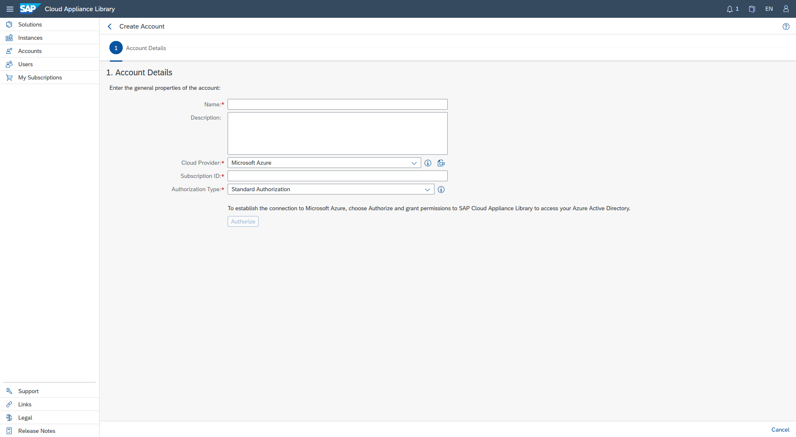{:.lead width="1200" height="893" loading="lazy"}
Connect CAL to Azure or AWS
{:.figcaption}
I create an account in the [SAP Cloud Applicance Library (CAL)](https://cal.sap.com/) and connect it to my Azure subscription by giving it an arbitraty name, adding my Subscription Id and the Standard Authorization Method. See [here](https://calstatic.hana.ondemand.com/res/~1608207188665~/docEN/042bb15ad2324c3c9b7974dbde389640.html) for a detailed documentation how to add your cloud subscription to your CAL account.

### 2. Provision your BW/4HANA instance

Now I head over to the Solutions screen and search for BW/4. I choose the Developer edition which comes with a free Developer license. The only costs are the costs that Azure charges me for the VMs.
As you can see below I provision my instance on Azure. The initial setup takes around 60 minutes so after creating the instance and storing the private key in a secure location its time to get a coffee.

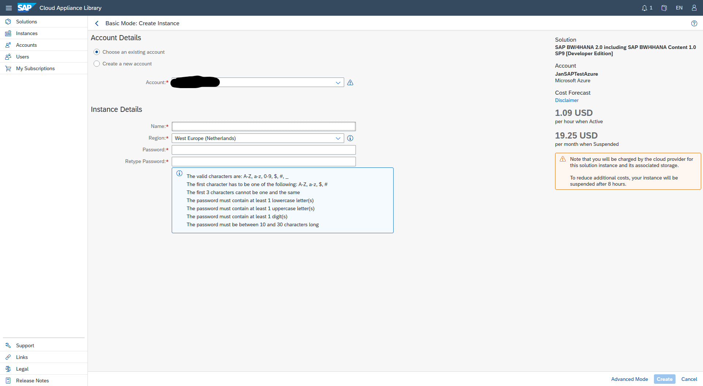{:.lead width="1200" height="893" loading="lazy"}
Provisioning
{:.figcaption}

### 3. Connect to the instance

At first I head over to the Azure Portal to see what was installed.

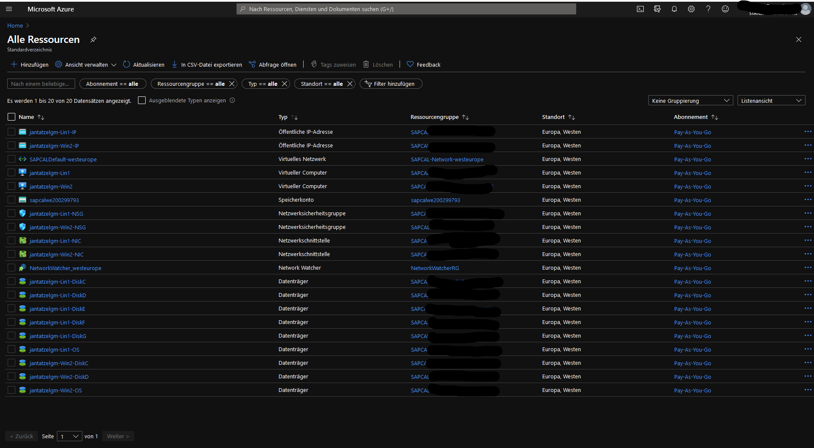{:.lead width="1200" height="893" loading="lazy"}
Installed Ressources
{:.figcaption}

Quite a few things were provisioned. In total I now have 2 VMs one Linux suse 12 which acts as the database and application server and a Windows VM with pre-installed modelling tools. I also see a few attached discs, and a virtual network for the Windows and Linux machine. Both are also exposed to the Internet which I can see either in my CAL overview or in your Azure portal.

Now I check what is running on the BW server. For this I need PUTTY. I had to convert the .pem key I downloaded earlier to a .ppk using PUTTYGen. I save the private key somewhere save and add it to my PUTTY connection configuration under SSH, Auth. According to the Getting started guide that I found on the CAL instance overview the Linux user is **root**

I check the exposed services with `netstat -tulpn` and boy there is a lot going on. You can see below that the SAP Webdispatcher is listening on ports in the 50000 range as well as the Hana Database (hdb) on local ports. According to the documentation the Webdispatcher seems to be a webserver and remote proxy that has functionality similiar to e.g. nginx [see here for details](https://help.sap.com/doc/7b5ec370728810148a4b1a83b0e91070/1511%20002/en-US/frameset.htm?frameset.htm). It can rewrite and filter URLs, act as load balancer if you have multiple application servers and SSL termination point. 

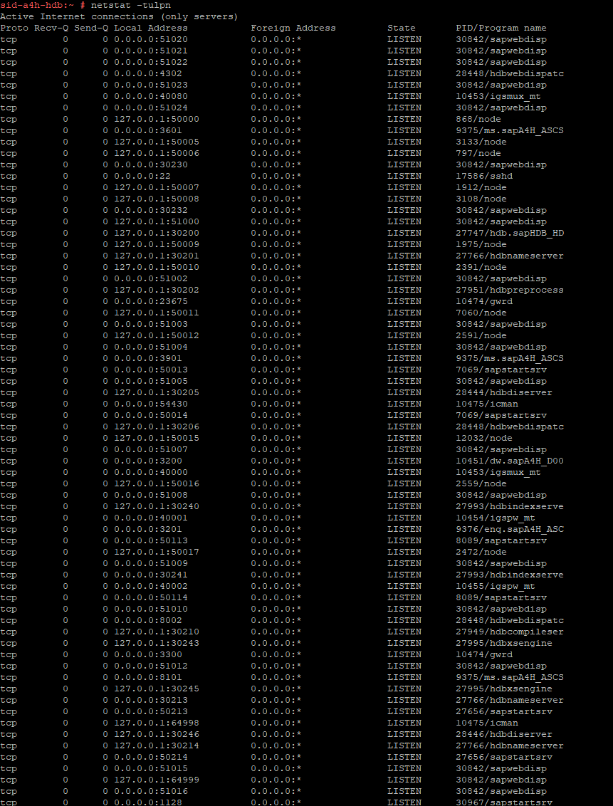{:.lead width="1200" height="893" loading="lazy"}
Exposed services
{:.figcaption}

#### The Database

Since Hana is already running I have a quick look into the database. For this I use the hdbsql command line tool which is located under `/usr/sap/<SID>/HDB<instance>/exe`. SID is "HDB" and instance is "02". I found these values in the Getting started guide.

With `hdbsql -i 02 -n localhost:30213` I was able to connect to the database. `SELECT * FROM TABLES;` shows the available tables. I was asked to enter my user "SYSTEM" and the password I entered during instance creation in the CAL. I found that there are only system tables available that did not make a lot of sense for me. But a first success, the connection to the database is established. I also quickly check whether I can connect from my local machine to the database. For this I used [DBeaver](https://dbeaver.io/), the database is also exposed to the internet. The user and password are the same, the IP is the external IP shown in your CAL instance details.
I discovered while reading the Security Aspects (!) of the Getting Started guide that on port 30241 the tenant DB of the ABAP system is exposed. I assume this is what BW uses. But also in this database I only find a huge range of (>30000 in the SAPHANADB schema) system tables.

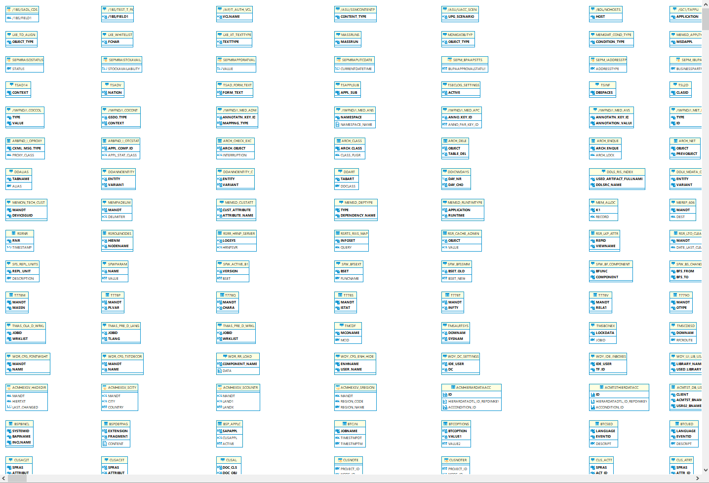{:.lead width="1200" height="893" loading="lazy"}
A lot of tables even before I added any data
{:.figcaption}

## Setting up HANA Modelling tools

Now let's get started for real. I change to the BW Modelling view with a click on the highlighted button below.

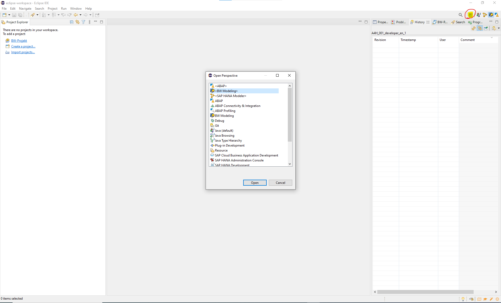{:.lead width="1200" height="893" loading="lazy"}
Modelling view
{:.figcaption}

Then I create a new BW project. I receive an error that SAP GUI is not setup. GUI is another graphical administration client. Before ecilpse it was also used for data modelling. I don't have it and hope I don't need it so I ignore the error message.

Now I have to enter the connection credentials. In the dropdown I can choose between the preselected Group Selection and Custom Application server. Since I dont know what my Message Server or my group is supposed to be I chose Custom Application Server. There I enter the system ID and the Instance number both from the getting started Guide and the application server IP from CAL. On the next page I enter user = "DEVELOPER" and the password I entered during provisioning. And ... I get an error. After trying different settings for instance number and Client. I check the port that the modelling tools try to connect to against what is configured in Azure. And well the 3300 port is not opened. I add the port to the network configuration. Now it returns an authentication error. After a bit of trial and error I find out that the DDIC user works.
{:.lead width="1200" height="893" loading="lazy"}
Connection
{:.figcaption}

Cool, I have a working connection. I still wonder why the setup processes is not described in the Getting Started guide. Maybe on the Windows VM that was spawned with the application and database server everyting is set up already for me? I try to connect but can't figure out the user name. It is none of the OS user names listed in the Getting started guide and also not the ssh user name Azure returns in the connection tab. So I reset the user via Azure portal and log on. On the VM SAP GUI and Lumira are preinstalled. Unfortunately there is no Eclipse Modelling tools. And even more unfortunate is that the SAP GUI is also not configured. So again with some trial and error I enter the connection information as below:

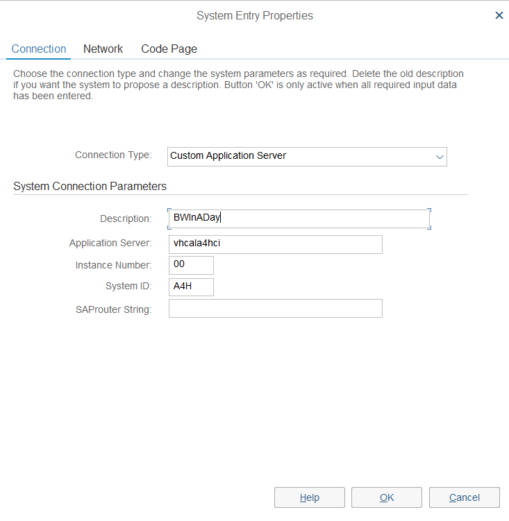{:.lead width="1200" height="893" loading="lazy"}
Connection SAP GUI
{:.figcaption}

For the application server it should also be possible to use the internal IP as shown in CAL or Azure Portal. I use the host name as returned by `sapcontrol -nr 00 -function GetSystemInstanceList` from the Bash on my Application server.

I dont know if I need SAP GUI for anything. The Getting Started guide mentions some set up transactions needed for setting up the BW/4HANA Client but also says that they are already done for the developer edition. I bravely assume that I have the developer edition. This is also the point where I stop my Windows VM to safe some money.

Okay now I have everything connected, took me only a couple of hours phew....

## Creating a Data Flow

In the BW-Repository I want to create a new InfoArea. This is the folder that all my data objects will live in. Right clicking a folder, new and InfoArea opens a context menu where I can enter the name and description of the area. But bummer... my user DDIC apparently has not the rights to create an InfoArea. After waisting time by trying to reconfigure or copy my project I simply create a new one and after with some more trial and error I find out that user DEVELOPER is set up on Client 001. What a joy, I created an InfoArea.

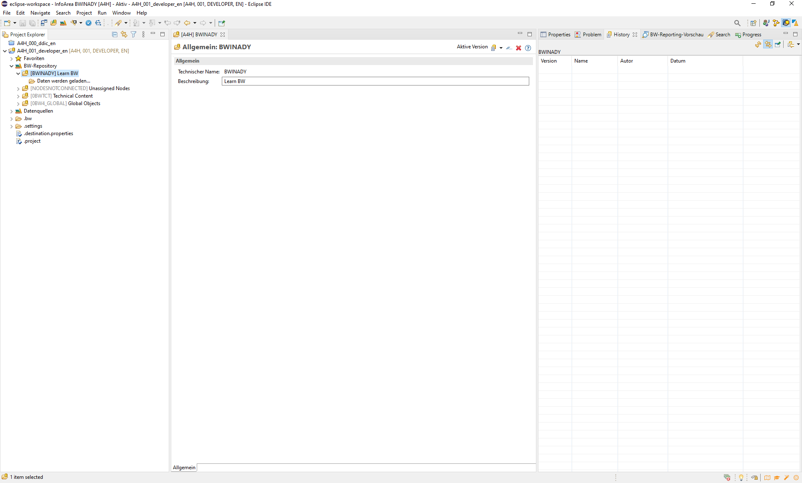{:.lead width="1200" height="893" loading="lazy"}
InfoArea
{:.figcaption}

Now I need a data flow to model my data. A right click on the InfoArea I created in the step before, selecting new and then Data Flow opens a context menu. Here I can only choose the name of the Data Flow. 

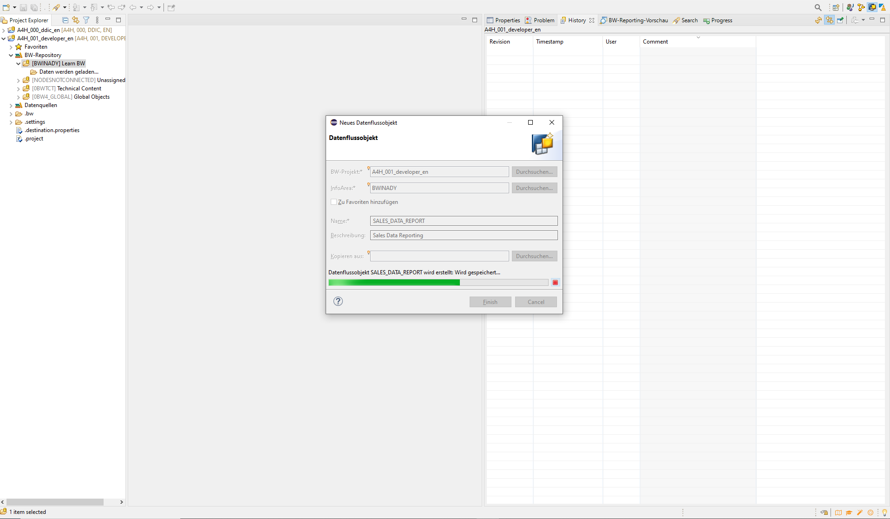{:.lead width="1200" height="893" loading="lazy"}
DataFlow
{:.figcaption}

I notice that in the InfoArea area tree on the left side no objects are shown, weird.... This is an issue since I can't drag and drop already created Data Objects or select them once I closed the context menu.

### Reconfigure the address of the project server

After my VM had an auto shutdown and the IP adress changed I had to reconfigure the IP address. After waisting some minutes searching for a context menu I find the .destination.properties file in the project navigation tree. There I can change the IP address. After restarting eclipse I was able to connect again. This only works though when project ist still opened. If not then you have to find your project working directory e.g.`C:\Users\<USER>\workspace\.metadata\.plugins\org.eclipse.core.resources.semantic\.cache\<PROJECT_NAME>\destination.properties`, weird right?

### Creating a Data Source and upload a csv

In my Data Flow I drag and drop the Source System to the Modelling window just to find out that I do not have a source system configured.

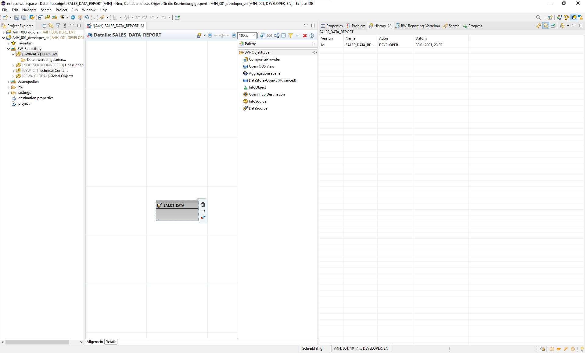{:.lead width="1200" height="893" loading="lazy"}
Adding a Data Source
{:.figcaption}

In the navigation tree on the left I right-click on Data source and add a new one. Now some trial and error and a google search tells me that I then have to again right click on the created data source, new and add DataSource. Here I run into a problem. After selecting None as my template I am asked to select an Application Component. I assume this is the program that allows me to ingest a file. But my system does not show me any...

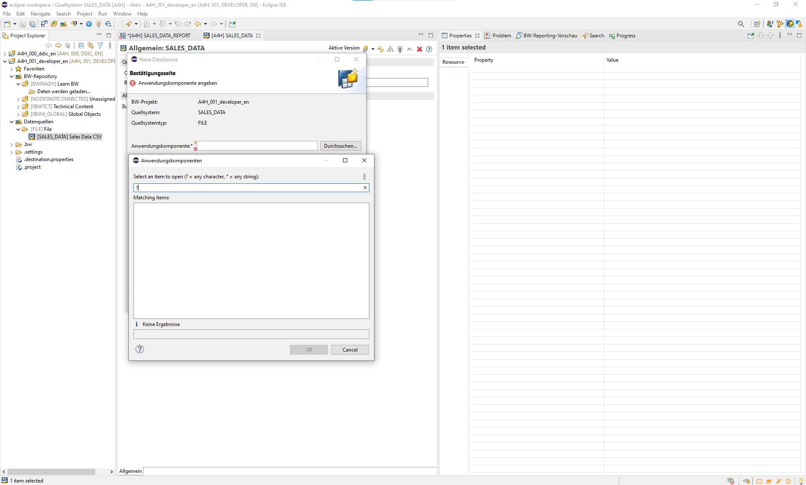{:.lead width="1200" height="893" loading="lazy"}
No application component
{:.figcaption}

So maybe I have to run the system set up transactions after all....

### Detour Set up transaction in SAP GUI

Heading back to the Windows VM with SAP GUI I connect and execute transaction `STC01` in the search like window on the top left. Then I enter `SAP_BW4_SETUP_SIMPLE` and click on view tasklist.

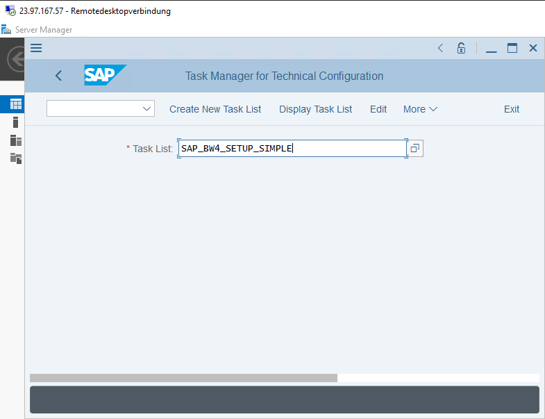{:.lead width="1200" height="893" loading="lazy"}
"easy" Set up transaction
{:.figcaption}

I see all the steps in the tasklist but apparently its still not running.

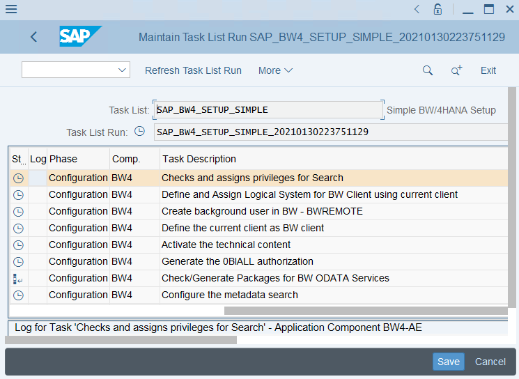{:.lead width="1200" height="893" loading="lazy"}
Task list
{:.figcaption}

Under More I can start the list but immediately get an error. A parameter in the first task seems to be missing. After some searching, I find out that I can add parameters in the task list shown above by clicking on a symbol in the column on the right. Here I have to add the Master Password and the same I have to do for another task below. I check all tasks that contain parameters but only two require the password.

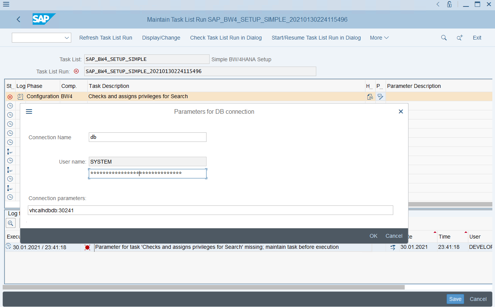{:.lead width="1200" height="893" loading="lazy"}
Add Parameters
{:.figcaption}

And yay, everything is running and green!

{:.lead width="1200" height="893" loading="lazy"}
All tasks are running
{:.figcaption}

Since I am already here I run the second task list which enables the BW 4 Launchpad, which I assume to be a Web application giving access to reports with the tas list `SAP_BW4_LAUNCHPAD_SETUP`. Nothing to configure here.

### Back to eclipse

Back in eclipse I find that this did not change the application component situation, so the entire detour had no effect.
At least I can now access the Launchpad from the Windows VM under `https://vhcala4hci.dummy.nodomain:54430/sap/bc/ui5_ui5/ui2/ushell/shells/abap/FioriLaunchpad.html?sap-client=001&sap-language=EN#Shell-home`. It somehow does not work from my local machine even when substituting the domain name with the external IP adress and opening up the port in Azure. But hey who is going to be picky here.

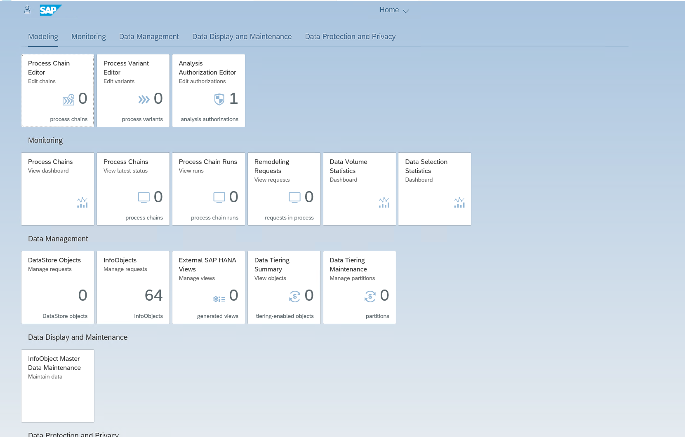{:.lead width="1200" height="893" loading="lazy"}
Launchpad running
{:.figcaption}

I am happy that it runs at all, even though this did not bring me closer to my goal of modelling a data flow. So I head back to google. 

## What the heck is an application component?

It seems my assumption that the application component is some sort of ingestion program that needs to be added to the backend is not correct. Another google search returns the following from the official SAP documentation: 

"An application component is a modeling construct within a process integration scenario. From a logical point of view, it represents a participant of a process integration scenario. This contains the business tasks and concerns that this participant represents within the process integration scenario.
An application component can stand for a business partner or a component of a business partner. At runtime it would be either one or more business systems or a integration process."

I really dont understand what they are trying to tell me and how this is connected with me loading data into the data base....
But more googling and trial and error leads me to another right click this time on my Data Source where I can create an Application component. Now I can add this application component to my Data Source and yay it works. Now I can configure my data source

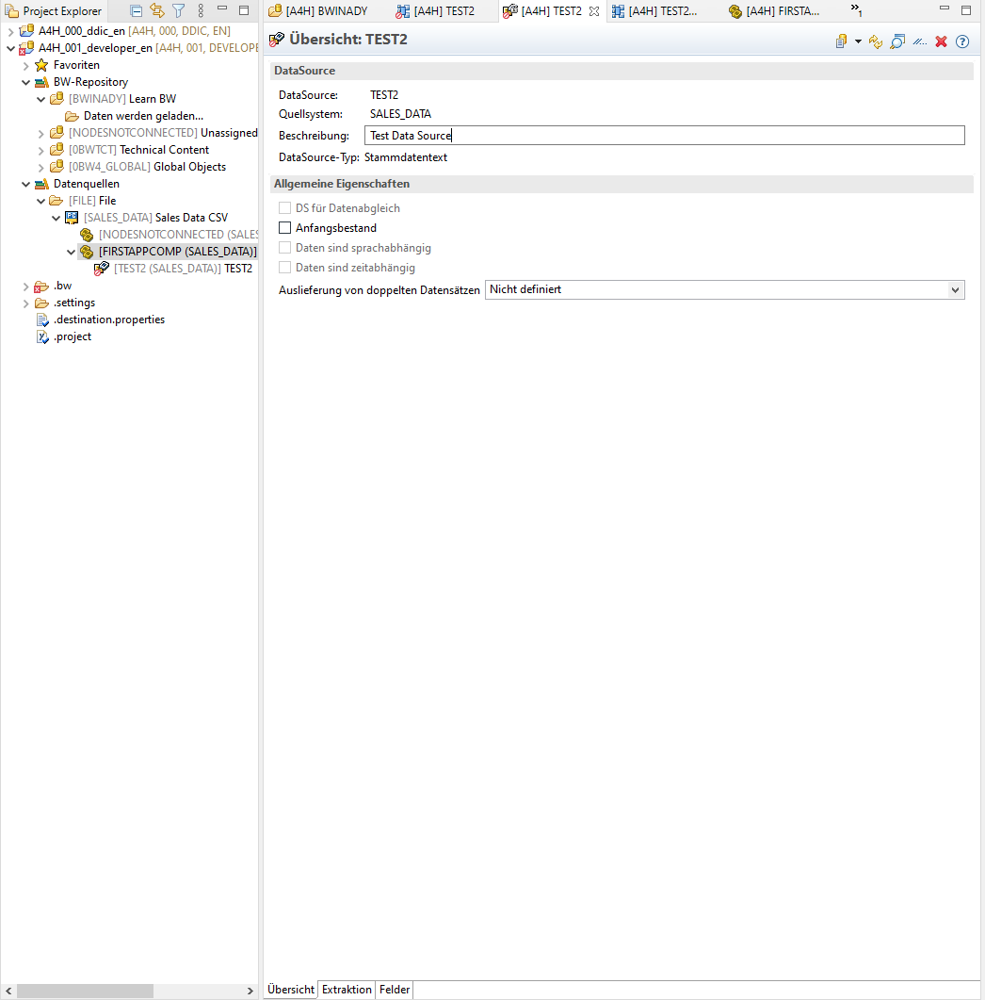{:.lead width="1200" height="893" loading="lazy"}
Well hidden extraction tab
{:.figcaption}

After that it literally took me half an hour to find this hidden extraction tab at the very bottom. Whilst I assumed that something was not configured right. Well maybe I am just tired.

In the extraction tab I can select the file, configure the separator and header and even infer the schema. This is the highlight of my day!

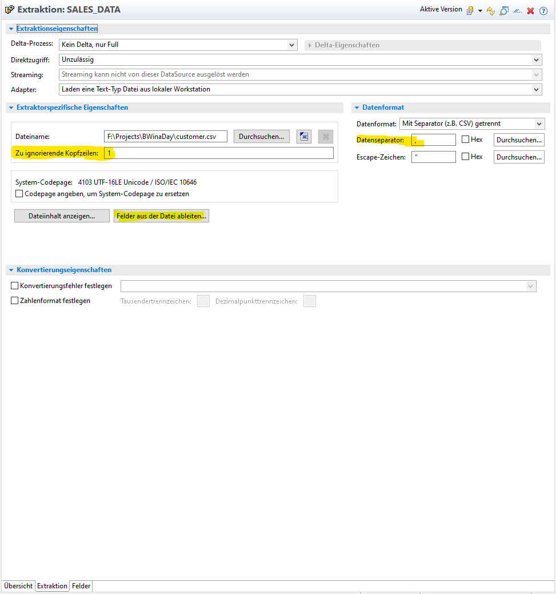{:.lead width="1200" height="893" loading="lazy"}
Settings of the Data Source
{:.figcaption}

After I activated the object in the menu bar I can see the data, on the right!

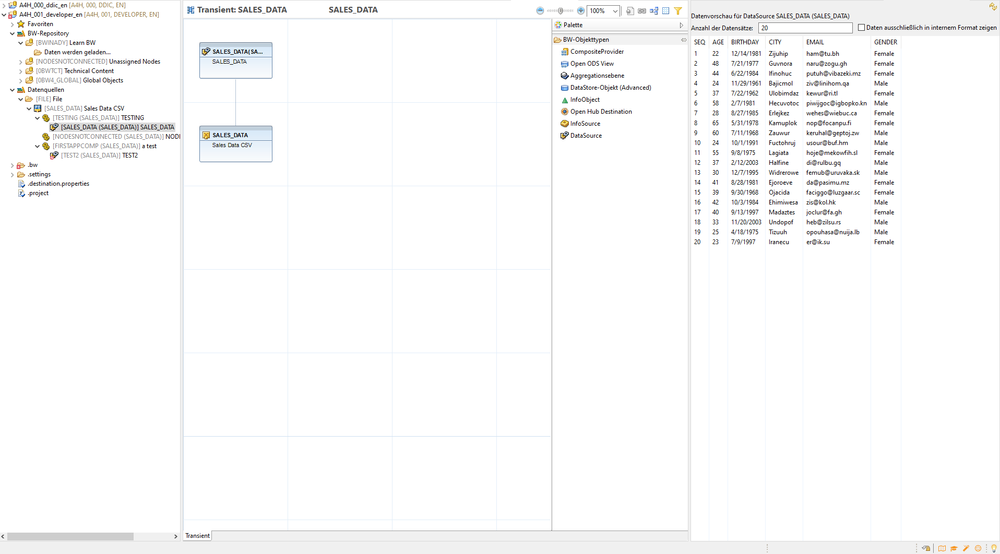{:.lead width="1200" height="893" loading="lazy"}
Finally data in the system!
{:.figcaption}

### Date conversion

Currently birthdate is saved as a string since in my input csv the date is stored as dd.mm.yyyy. I want to convert it to a DATS, the BW date format. BW usually saves dates as yyyymmdd. So back to the Data Source settings. 

In the tab fields i find the setting conversion routines which offers me a long list of cryptic routines. "Conversion exit for domain GBDAT" again I am a bit lost. I was hoping for something along the lines of the C standard `%d.%m.%Y`. Well back to trial and error then.

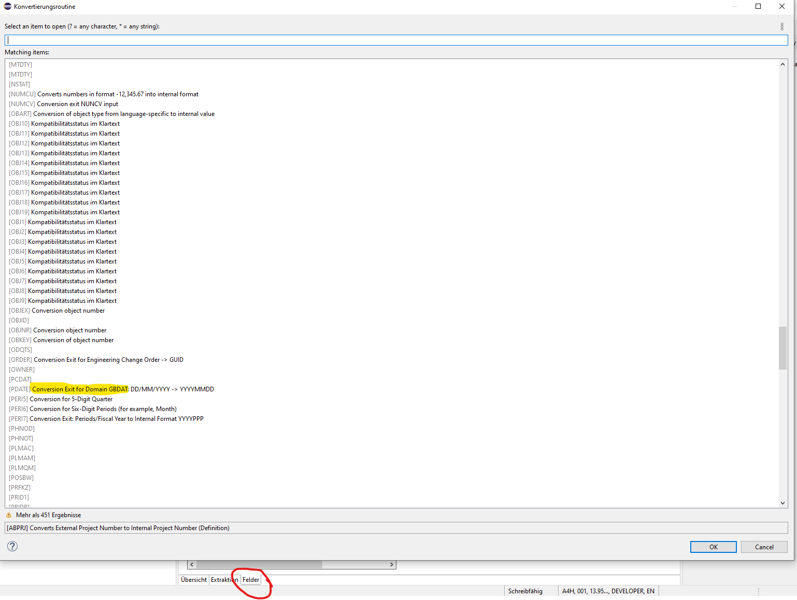{:.lead width="1200" height="893" loading="lazy"}
Date conversion
{:.figcaption}

Some blog suggests using the RSDAT conversion routine. I find it odd that it does not allow me to specify the input format, but I succeed loading and converting the date.

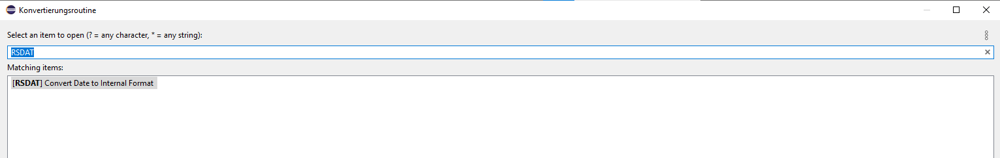{:.lead width="1200" height="893" loading="lazy"}
RSDAT Conversion Routine
{:.figcaption}

Since I am already here I rename the sequence column to customerID and declare it as the primary key of my table. Now its time to add some transactional data. I will simply use a csv again with a salesID column as primary key and a customerID as foreign key, a date and value column.

I add a new data source TRANS_DATA and it inherits the application components from my first data source. I am really still a bit confused what they are and do. Is it okay to use the same one created for my first data source? Well lets try.

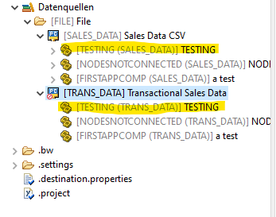{:.lead width="1200" height="893" loading="lazy"}
Application Components are the same
{:.figcaption}

Yep, seems to work and I notice that trial and error shows in my naming convention. I created a lot of test objects ;). This time with the european csv format with a ";" (semicolon) as a separator and homogenous date formatting, BW directly recognizes the date format and suggests a conversion. I note that the date is now shown as yyyymmdd which is the HANA format. This is different to the first data source and I have the feeling that the date conversion above was not successful. But for the moment I continue anyways.

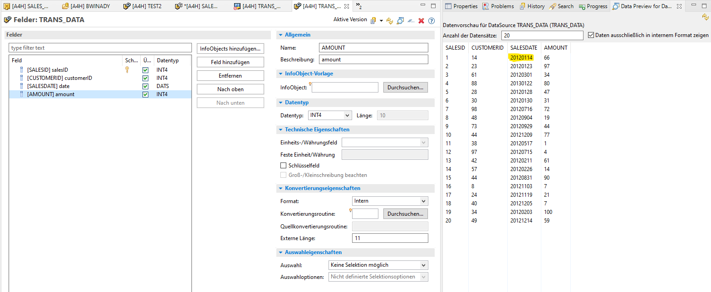{:.lead width="1200" height="893" loading="lazy"}
Application Components are the same as in my first data source
{:.figcaption}

### Persistency Layer

Now back to the data flow. By this time I renamed my data source to CUSTOMER. I drag and drop an advanced Data Store Object as staging layer on my data flow and configure it to copy my data source. Advanced DSOs are the workhorse in BW/4. They together with the Infoobjects make up the persistent layer. Advanced DSOs can be configured to support Change Data Capture by writing a log file to a separate table, partioning according to some function as well as indexing is also supported. Moreover I can activate a write interface for planning functionality, compress the table etc... Basically I understand what happens is that an ADSO object creates a whole bunch of tables in the HANA db. I understand that an ADSO looks for the user like a table and should as such also be accessible directly in the HANA database with the fields I configured.
Infoobjects on the other hand are optimized for OLAP performance and are either characterisitics (Master Data) or KeyFigures. They can be used to navigate the report (navigation attributes) and their attributes are again Infoobjects. This is different to the ADSO which is based on fields, i.e. columns. I chose a standard ADSO as below. I note that the ADSO has a particular activation sequence. First create the ADSO then connect it with the object it should obtain data from and only **then** activate it. Else it will return the error, that it does not contain any fields. Drawing the connection after activation did not work for me, I guess there is some trick that I don't know.

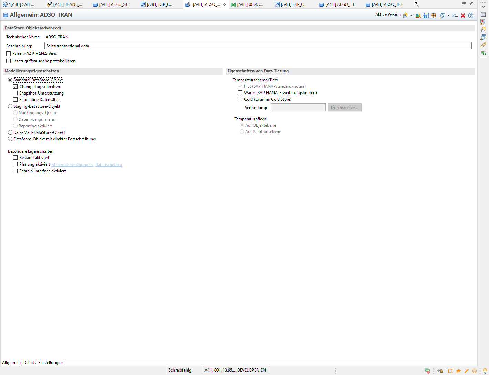{:.lead width="1200" height="893" loading="lazy"}
ADSO configuration
{:.figcaption}

For each ADSO I have to add a transformation that allows me to define a transformation routine. Again this works by right clicking the ADSO.

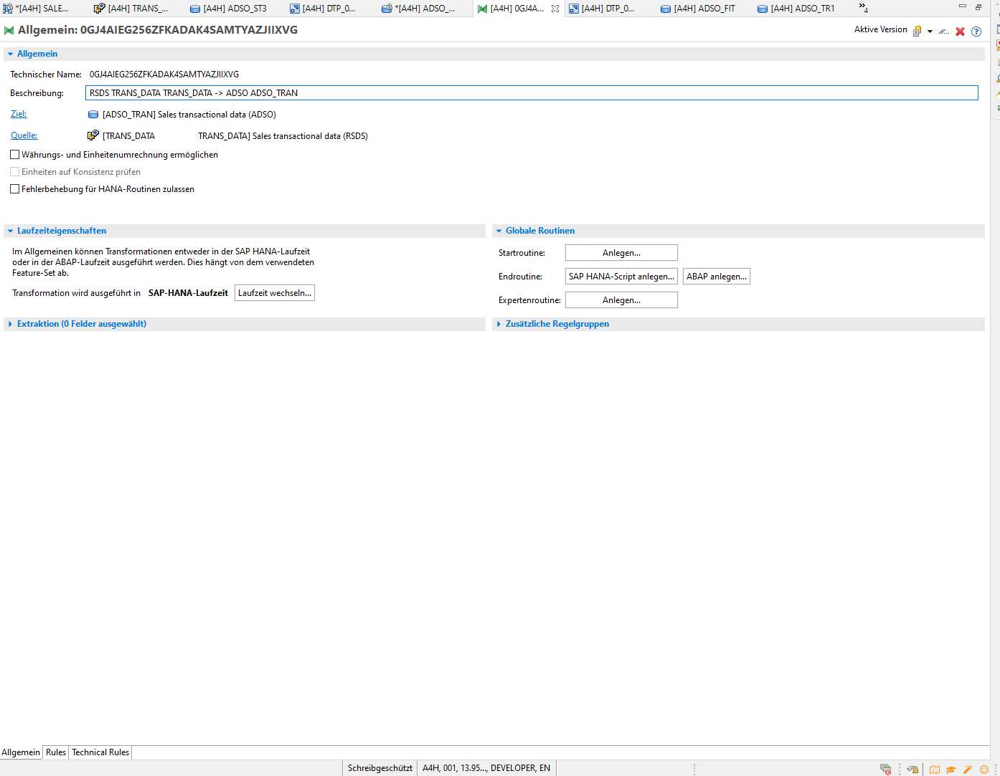{:.lead width="1200" height="893" loading="lazy"}
Add Transformation
{:.figcaption}

here I can also drag and drop the mapping and even add some formulas in the mapping. As you can see below I take the absolute value of the integer amount, its positive anyways but for the sake of trying it out ..., and change the variable type to unit. Variable Type currency would require me to specify a currency field which I do not have.

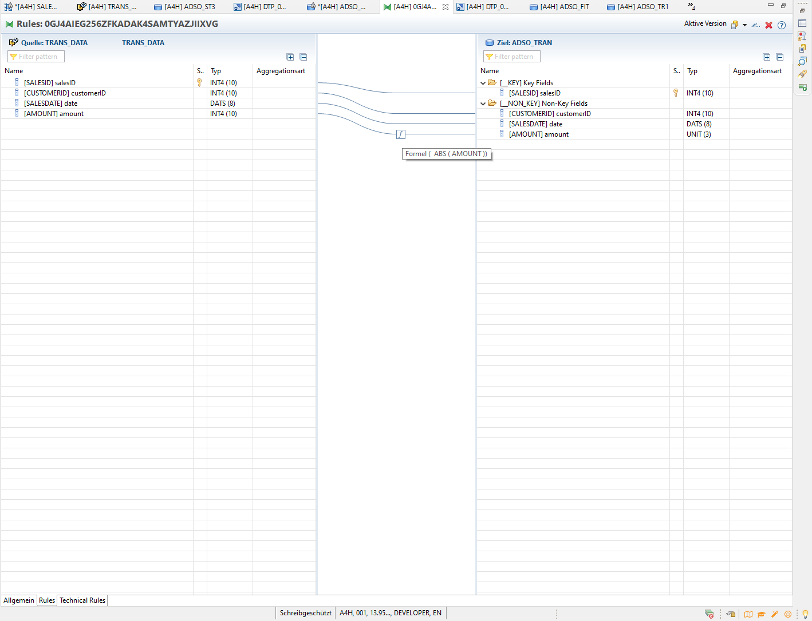{:.lead width="1200" height="893" loading="lazy"}
Mapping
{:.figcaption}

Now I also have to add a Data Process Routine which is again done by a right click. Here I can configure parallelization of extraction tasks but also filtering etc. I leave everything as is. Each object has to be activated after the configuration. 

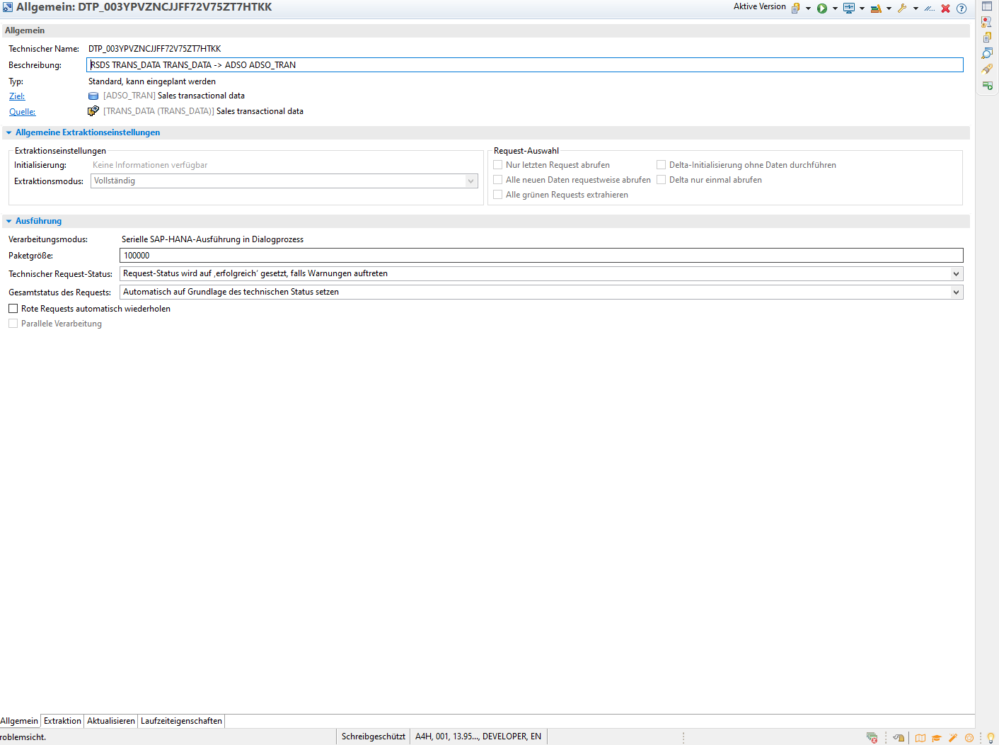{:.lead width="1200" height="893" loading="lazy"}
Mapping
{:.figcaption}

No so far so good, thats all I need for an ADSO. I add a couple more ADSOs to check what happens when I choose different types. And finally I add my Master data to conclude my learning journey with the following flow:

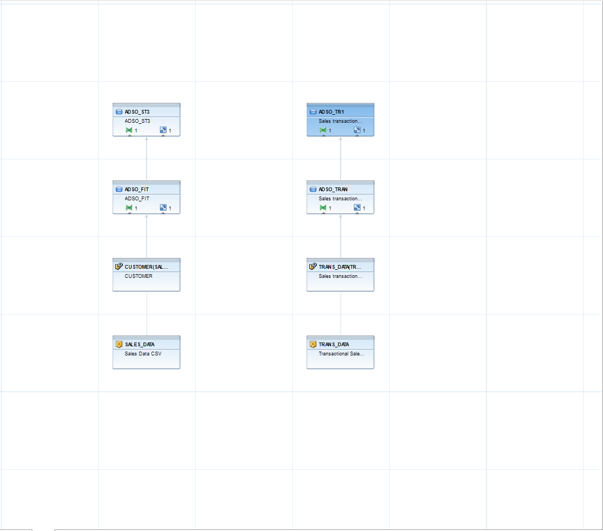{:.lead width="1200" height="893" loading="lazy"}
Flow for the day
{:.figcaption}

## What's next
 
 One day was not enough to explore the virtual data objects such as the composite provider or the Open ODS View. For example to join my two tables I need a composite provider and some join routine. I save this task for another day.

 ## My learnings

Phew a long day indeed. What seems like an easy task loading and transforming some csv data in BW took me the entire day. Okay I had to setup the entire system which took quite a while but still I wonder what made it so hard.

### Documentation could be better

The documentation I found was often patchy at best and I had to connect different blogs and the SAP official documentation to gain an understanding. Most often even after researching I had to fall back to trial and error. One example is the dated Getting Started guide that sould be a lot more detailed, see also this SAP thread [here](https://blogs.sap.com/2020/02/24/setting-up-a-bw-4-instance-in-cal/).

### A lot of clicking

Setting up a data flow required a lot of clicking. Most configurations have to be done by context menus that are often not self-explanatory. I get it with time you learn how to efficiently navigate these but I would love to a code option (there probably is one, that I am simply not aware of). Compare VSCode where every setting can also be done in a JSON.

### What about my expectations

Well setup was manageable but not as simple as spinning up a docker container.
My first admittedly high expecatiton that stuff just works was not met. . Also neither the search function, nor the navigation tree worked properly. All in all a lot of stuff requires setting up or a very good understanding of how the application works This understanding is not easy to obtain, see documentation above.

### Much stuff left to explore

Obviously there is still a lot to explore in BW/4. Especially the more advanced topics like partioning, warm/ cold storage, delta loads etc are enough for a few more blog post. I might have to rethink my strategy though.

## Thank you

If you made it so far congratulations and a huge thanks. I definitely plan to do some more exploring and write about my experience.

--------

###### The screenshots are my own, the header picture is a license free picture fom pixabay